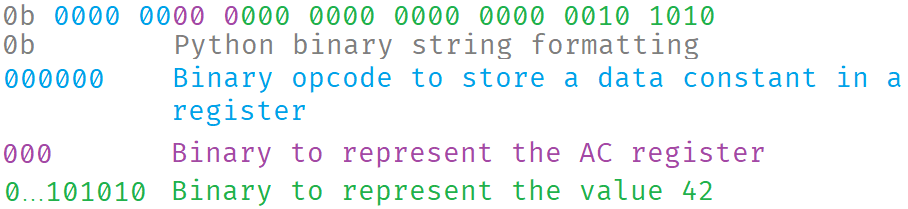

# Tasm
This is an assembler for my virtual machine [toy-machine](https://github.com/MrSquigy/toy-machine).

To assemble a file, simply run `python tasm.py <filename> [-o output_name]`. Tasm files have the `.tasm` extension.

## Instruction Reference
### Instruction Format
A tasm instruction is 32 bits long. The opcode is 6 bits and the remaining 26 bits are used for instruction arguments. Each machine code line looks like this.

This instruction therefore stores the value 42 in the AC register.

### Data Movement Instructions
The data is stored in the leftside operator  
E.g. `mov AC, 5` will store the value 5 in the AC register.

- `mov <reg>, <const>`
- `mov <reg>, <mem>`
- `mov <mem>, <const>`
- `mov <mem>, <mem>`
- `mov <mem>, <reg>`
  
### Arithmetic Instructions
The result of the operation is stored in the leftside operator
- `add <reg>, <const>`
- `add <reg>, <mem>`
- `add <mem>, <reg>`